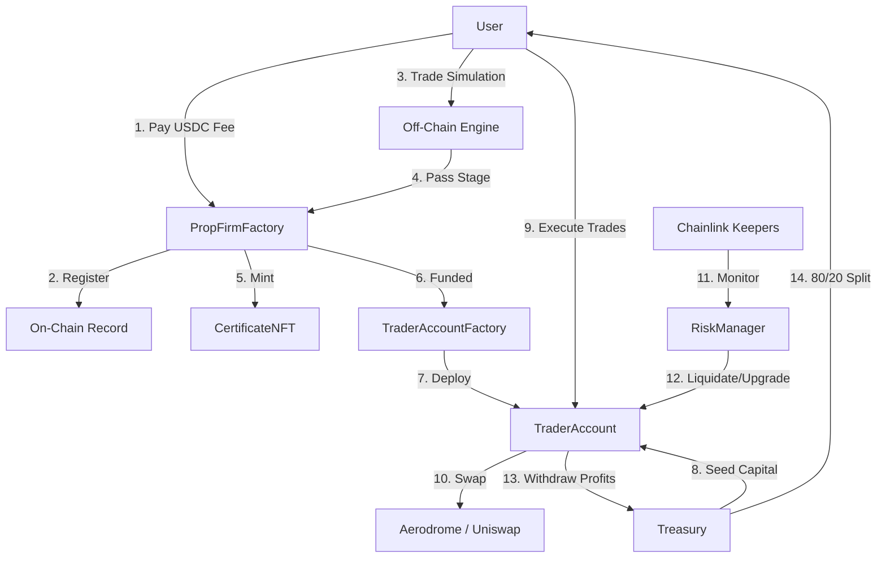

# Smart Contract Architecture for Base Capital

This document outlines the smart contract infrastructure for **Base Capital** - a fully on-chain Proprietary Trading Firm on the **Base** blockchain.

## Overview

Base Capital replaces traditional off-chain prop firm infrastructure with immutable smart contracts that:
- Enforce trading rules on-chain
- Manage firm capital through isolated smart wallets
- Handle trader progression through Challenge → Verification → Funded stages

We leverage **Smart Contract Wallets** to give traders a controlled trading environment on real DEXs (Aerodrome, Uniswap) while the protocol enforces risk parameters.

## Core Smart Contracts

### 1. `PropFirmFactory.sol` (Onboarding Layer)

Manages user registration, fee collection, and stage progression.

| Function | Description |
|----------|-------------|
| `startChallenge(planId)` | Accepts USDC fee, registers trader |
| `upgradeTrader(trader)` | Advances trader to next stage |
| `failTrader(trader)` | Marks trader as failed |

### 2. `TraderAccount.sol` (Smart Wallet)

Isolated smart wallet controlled by trader but restricted by protocol.

**Key Features:**
- ✅ Whitelisted DEX interactions only (Aerodrome, Uniswap)
- ✅ Traders can execute swaps via `executeSwap()`
- ❌ Cannot withdraw principal capital
- ✅ Can withdraw profits above initial balance

### 3. `RiskManager.sol` (The Enforcer)

Real-time rule enforcement via Chainlink Automation.

| Rule | Challenge | Verification | Funded |
|------|-----------|--------------|--------|
| Profit Target | 8% | 5% | N/A |
| Max Daily Loss | 5% | 5% | 5% |
| Max Total Loss | 8% | 8% | 10% |
| Min Trading Days | 5 | 5 | 0 |

**Functions:**
- `checkStatus(account)` - Evaluates trader against rules
- `batchCheckStatus(accounts)` - Batch evaluation for keepers
- `checkUpkeep()` / `performUpkeep()` - Chainlink Automation interface

### 4. `Treasury.sol` (Capital Management)

Holds firm capital and manages profit distributions.

| Function | Description |
|----------|-------------|
| `seedAccount(account, planId)` | Allocates capital to funded trader |
| `processProfitWithdrawal()` | Handles 80/20 profit split |
| `recoverCapital(account)` | Recovers funds from liquidated accounts |

**Profit Split:** 80% trader / 20% protocol

### 5. `CertificateNFT.sol` (Achievement System)

ERC-721 NFTs minted when traders complete stages.

## Data Flow

## Base Integration Points

### Coinbase Smart Wallet
Users sign in with **Passkeys** - no browser extension needed. Smart Wallet provides seamless onboarding with account abstraction.

### Gas Efficiency
Base L2 enables frequent `checkStatus()` calls via Keepers without massive costs, ensuring real-time rule enforcement.

### USDC on Base
All accounting in **USDC** (native on Base) avoids volatility risk in trader's principal balance.

## Development Phases

| Phase | Status | Description |
|-------|--------|-------------|
| Phase 1: Paper | ✅ Complete | Off-chain simulation via EvaluationContext |
| Phase 2: Hybrid | ✅ Complete | On-chain fees + off-chain trading + NFT certificates |
| Phase 3: On-Chain | ✅ Complete | Full smart wallet trading with RiskManager |

## Contract Addresses

See [contracts/README.md](./contracts/README.md) for deployed addresses.
