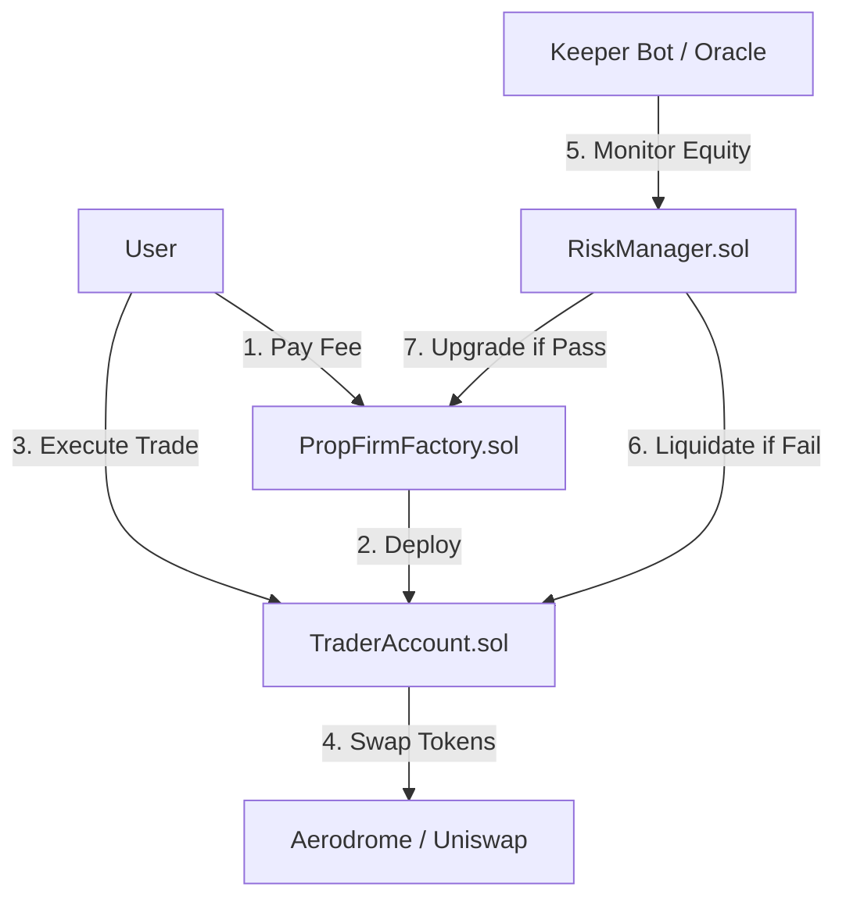

# Smart Contract Architecture for Base Capital

This document outlines the smart contract infrastructure required to transition **Base Capital** from a simulated environment to a fully on-chain Proprietary Trading Firm on the **Base** blockchain.

## Overview

The goal is to replace the current `EvaluationContext` (local state) with immutable smart contracts that enforce trading rules, manage funds, and handle the progression of traders through the **Challenge**, **Verification**, and **Funded** stages.

We will leverage **Account Abstraction (ERC-4337)** or **Smart Contract Wallets** to give traders a controlled environment where they can trade on real DEXs (like Aerodrome or Uniswap on Base) while the protocol enforces risk parameters.

## Core Smart Contracts

### 1. `PropFirmFactory.sol` (The Onboarding Layer)
**Purpose**: Manages user registration, fee collection, and the deployment of Trader Accounts.

*   **Functions**:
    *   `startChallenge(uint256 planId)`: Accepts the registration fee (in USDC/ETH) and deploys a new `TraderAccount` for the user.
    *   `upgradeUser(address trader)`: Verifies if a trader has passed a stage and upgrades them (e.g., Challenge -> Verification).
*   **Base Integration**: Optimized for Base's low gas fees to keep onboarding costs negligible.

### 2. `TraderAccount.sol` (The Smart Wallet)
**Purpose**: A smart contract wallet controlled by the trader but restricted by the protocol. This holds the trading capital (or "demo" capital in early stages).

*   **Key Features**:
    *   **Whitelisted Interactions**: Can ONLY interact with approved protocols (e.g., Aerodrome Router, Uniswap Router).
    *   **Restricted Withdrawals**: The trader CANNOT withdraw the principal capital.
    *   **Owner Access**: The trader can sign transactions to execute swaps.
*   **Why**: This allows "Real" trading on-chain without giving the trader custody of the firm's funds.

### 3. `RiskManager.sol` (The Enforcer)
**Purpose**: Replaces `checkRules` in `prop-firm-logic.ts`. It monitors the `TraderAccount` equity and enforces drawdown rules.

*   **Logic**:
    *   **Max Daily Loss**: Tracks equity at 00:00 UTC vs current equity.
    *   **Max Total Loss**: Tracks initial balance vs current equity.
    *   **Profit Target**: Checks if the balance >= target.
*   **Enforcement**:
    *   `checkStatus(address traderAccount)`: Callable by anyone (or a Keeper bot).
    *   If a rule is violated, it calls `liquidate()` on the `TraderAccount`, disabling the trader's access.

### 4. `Treasury.sol` (The Vault)
**Purpose**: Holds the protocol's revenue (challenge fees) and the liquidity pool for funded traders.

*   **Functions**:
    *   `withdrawFees()`: For protocol admins.
    *   `payoutTrader(address trader, uint256 amount)`: Sends profit splits to successful funded traders.

## Data Flow & Architecture

## Base.org Specific Integrations

1.  **Coinbase Smart Wallet**:
    *   We will integrate the **Smart Wallet** SDK to allow users to sign into the app using Passkeys, removing the need for a browser extension wallet. This lowers the barrier to entry significantly.
    
2.  **Gas Efficiency**:
    *   Base is an L2. We can perform frequent `checkStatus` calls (via Keepers) without incurring massive costs, ensuring real-time rule enforcement.

3.  **USDC on Base**:
    *   All accounting will be done in **USDC** (native on Base) to avoid volatility in the trader's principal balance.

## Development Roadmap

1.  **Phase 1: The "Paper" Layer (Current)**
    *   Keep logic off-chain (current state).
    *   Use `EvaluationContext` to simulate trades.
    
2.  **Phase 2: Hybrid Verification**
    *   Deploy `PropFirmFactory` to take fees on-chain.
    *   Keep trading off-chain (simulated).
    *   Mint an NFT "Certificate" when a user passes.

3.  **Phase 3: Fully On-Chain (The Goal)**
    *   Deploy `TraderAccount` smart wallets.
    *   Seed accounts with real USDC.
    *   Allow trading on whitelisted DEXs.
